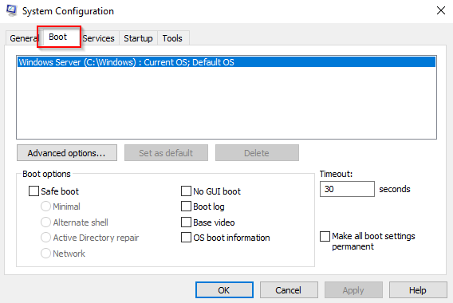

# What is DSRM?

DSRM (**Directory Services Restore Mode**) is a special boot mode in Windows Server used to repair or restore Active Directory (AD) databases. It is primarily used in the following scenarios:

1. **AD Database Recovery**: If the AD database is corrupted or needs recovery, administrators can boot the server in DSRM to perform database repairs or restorations using tools like `ntdsutil`.
    
2. **AD Backup Restore**: When restoring a backup of the AD database, DSRM allows the administrator to restore the backup without interference from the system's normal operations.
    
3. **Password Reset for AD Administrator**: If the AD administrator account's password is lost, DSRM can be used to reset it.

# Resetting DSRM Password

To log in to DSRM, you need the DSRM password. If you don't know it, the best option is to reset the DSRM password and then try to login to the backup account.

```
C:\Users\Administrator> ntdsutil
ntdsutil: set dsrm password
Reset DSRM Administrator Password: reset password on server <server name>
Please type password for DS Restore Mode Administrator Account: <password>
Please confirm new password: <retype password>
Password has been set successfully.
```


# Login to the DSRM Account

### Using System Configuration (msconfig)

1. **Open the Run Dialog**:
    
    - Press `Win + R` to open the Run dialog.


2. **Launch System Configuration**:
    
    - Type `msconfig` and press **Enter**.


3. **Go to the Boot Tab**:
    
    - In the System Configuration window, click on the **Boot** tab.


4. **Select Safe Boot**:
    
    - Under the Boot options section, check the box for **Safe boot**.


 5. **Apply and Restart**:

	- Click **Apply**, then **OK**.
	- You will be prompted to restart your computer. Click **Restart** to boot into Safe Mode


Upon restarting in Safe Mode, logging in with a domain account username and password won't be possible. This is because Safe Mode does not load the domain accounts. Instead, only the local account, specifically the DSRM account, is available for login.


Try logging in using the `.\Administrator` account, which is the local server's DSRM account.


Now that we're logged into the backup account, you can troubleshoot any server issues or retrieve data for backups.


To have the domain controller boot normally again, simply uncheck the Safe Boot option in the **msconfig** Boot menu and restart the server. That will revert the settings and return the system to normal boot mode.