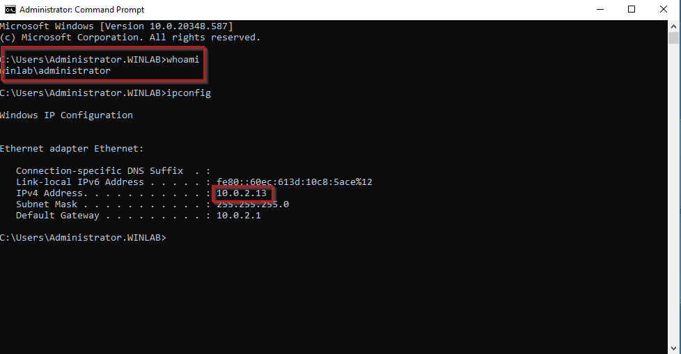

# **Joining a Windows Client to a Domain Controller**

Joining a Windows client to a domain controller is a crucial task in enterprise environments. This process enables centralized management, security policies, and access control for users and devices. Here is a detailed, step-by-step guide to achieve this.

### **Prerequisites**

Before joining the client to the domain, ensure the following:

- **Domain Controller**:
    
    - A domain controller (DC) is properly configured and running.
        
    - The Fully Qualified Domain Name (FQDN) of the domain is known (e.g., `winlab.local`).


        
- **Windows Client**:
    
    - The client machine is running a compatible version of Windows.
        
    - The client can communicate with the domain controller (check network settings).


> NOTE: Domain Controller IP is 10.0.2.12


        
- **DNS Configuration**:
    
    - The client’s DNS settings point to the domain controller’s IP address.
        

### **Step-by-Step Process**

#### **1. Verify Network Connectivity**

- Open the Command Prompt on the client machine.
    
- Ping the domain controller using its FQDN:
    
    ```
    ping winlab.local
    ```
    
- Ensure a successful reply to confirm network connectivity.
    

#### **2. Configure DNS Settings**

- Go to **Control Panel > Network and Sharing Center > Change Adapter Settings**.
    
- Right-click the active network adapter and select **Properties**.
    
- Highlight **Internet Protocol Version 4 (TCP/IPv4)** and click **Properties**.
    
- Set the **Preferred DNS Server** to the IP address of the domain controller.
    
- Click **OK** to save the settings.


#### **3. Access the System Properties**

- Right-click **This PC** or **My Computer** and select **Properties**.
    
- Click **Change settings** under the **Computer name, domain, and workgroup settings** section.
    

#### **4. Join the Domain**

- In the **System Properties** window:
    
    - Navigate to the **Computer Name** tab.
        
    - Click **Change**.
        
- In the **Computer Name/Domain Changes** dialog:
    
    - Select the **Domain** option.
        
    - Enter the domain name (e.g., `winlab.local`) and click **OK**.
        


#### **5. Authenticate with Domain Credentials**

- A dialog box will prompt for credentials.
    
- Enter the username and password of a domain user with permission to join devices to the domain.
    
- Click **OK**.
    


#### **6. Restart the Computer**

- After a successful authentication, you’ll see a confirmation message.
    
- Click **OK** and restart the computer to apply the changes.
    

#### **7. Verify Domain Membership**

- Log in to the computer using domain credentials (e.g., `winlab\Administrator`).
    
- Open the Command Prompt and run:
    
    ```
    whoami
    ```
    
- Ensure the output shows the domain and username.



Joining a client to a domain controller is a key step in building a secure and efficient network. With this process, managing users and resources becomes much simpler.