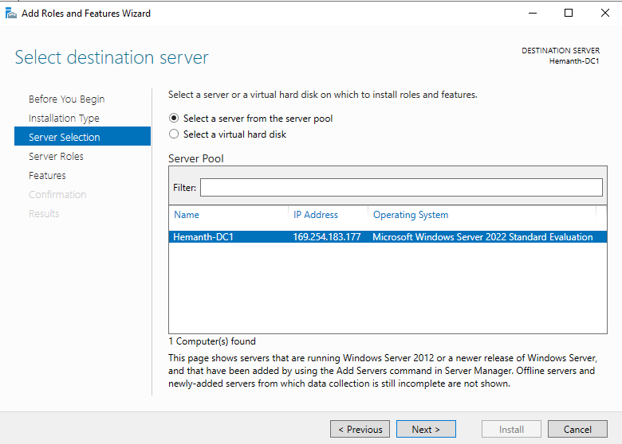

# Promoting to Domain Controller

Imagine a big company. It has lots of employees, computers, and devices. Managing who can access what, keeping track of passwords, and making sure everyone only sees what they need would be a big headache. That’s where Active Directory comes in.

When you turn on your office computer, you need to log in with your username and password. Active Directory checks:

1. **Are you really you?** It verifies your username and password.
2. **What can you access?** If you’re in the Marketing department, it will let you open the Marketing folder but block access to confidential HR files.

With AD, everything is centralized. If you forget your password, IT can reset it for you using AD. If you change roles, AD updates your access without needing to go to every computer.

It’s like a behind-the-scenes helper that keeps everything organized, secure, and running smoothly!

---

# Installing AD Feature

In the **Server Manager** under the **Local Server** section, you may notice that the "Workgroup" setting is currently set to "WORKGROUP." This is the default name assigned to workgroups in Windows operating systems. A workgroup is essentially a basic networking model designed for small groups of computers to share resources, like files and printers, without requiring a centralized server or directory service like Active Directory.

In the top-right corner of the **Server Manager** panel, you'll find the option to click on **"Add Roles and Features"**. This option is essential for configuring your server to take on specific roles or features, such as acting as a web server (IIS), DNS server, or file server.

Once you click on "Add Roles and Features", a wizard window will pop up to guide you through the setup process. On the first page, you'll typically see an introduction or some preliminary information about what the wizard can do.

To proceed, simply click the "Next" button at the bottom of the page.

On the next page of the wizard, select "Role-based or feature-based installation" and then click "Next". This option allows you to install roles or features directly on a specific server, which is what we’ll be doing.

In this case, we’re going to install the Active Directory feature on a Windows Server 2022 system.

>Note: Active Directory is a built-in Windows feature that enables centralized management of users, devices, and permissions across your network. 

On the **"Select destination server"** page of the wizard, you’ll see the **server pool** listed. Simply choose your Windows Server from the list (it should be the only option in this case), and then click **"Next"** to proceed

On the **"Select server roles"** page, this is where you can add all the roles and features you need for the server. In this setup, we’ll be adding the **Active Directory Domain Services (AD DS)** role and the **DNS Server** role. These two features work closely together to manage domain-based networks and provide name resolution services.

1. Locate and check the box for **Active Directory Domain Services**.
    - A pop-up may appear to add additional required features. Click **"Add Features"** to confirm.
2. Similarly, check the box for **DNS Server**.
    - Again, confirm any additional features if prompted.

Once both features are selected, click **"Next"** to continue with the setup

The tools which are require to run AD Service will be installed. click "Add features"

Same for DNS installation, Click "Add features"

Leave everything to default and click "Next"

Lastly click "install" to install all the AD feature and required tools

# Promoting to DC

To promote the server to Domain Controller, click on the following.

If you are working with an existing **Active Directory forest** and want to add this server as a **Domain Controller (DC)** to an existing domain, you can select the first option: **"Add a domain controller to an existing domain."**

After selecting this option, you will need to:

1. Enter the name of the existing domain (e.g., `example.com`) in the provided field.
2. Ensure you have proper credentials with administrative privileges for the domain so that the setup can proceed smoothly

In this setup lets create a new forest named "*winlab.local*", shall we!. click "**Add new forest**"

When configuring **Domain Controller (DC) Options**, you’ll notice an option to make the Domain Controller also act as a **DNS Server**

>**Note:** In Active Directory, all Domain Controllers automatically function as **DNS Servers** for their domain

In this step, you’ll need to set the **Directory Services Restore Mode (DSRM)** password. This password is essential because it allows you to access the server in **Recovery Mode**, which is used to troubleshoot or repair the Active Directory database if something goes wrong.

>**Note:** Make sure to document this password securely, as it will be required in the event of a system recovery. Losing it can make restoring your server much more challenging.

Click next for dns delegation.

Server will automatically pick a NetBIOS name for us. Click next.

In the next step, you’ll see options to specify the locations for important Active Directory files:

- **SYSVOL folder**: This folder stores the server’s public files, such as group policies and login scripts, that need to be replicated to other Domain Controllers.
- **NTDS folder**: This folder contains the **NTDS.dit** file, which holds the Active Directory database with all the directory data, including user accounts, security information, and group memberships.

By default, these folders are stored in the system drive (usually `C:\`), but you can change the locations if needed

Finally!. Click Install to setup and after the installation completed restart the server.

After Rebooting we can see our workgroup have changed to "*winlab.local*". The **"winlab.local"** domain name is now associated with your Active Directory setup, and your server has become a **Domain Controller (DC)** for this domain. This change means your server can now manage authentication, user access, and other domain-related services across the network

We can also see the DNS address is set to localhost.

