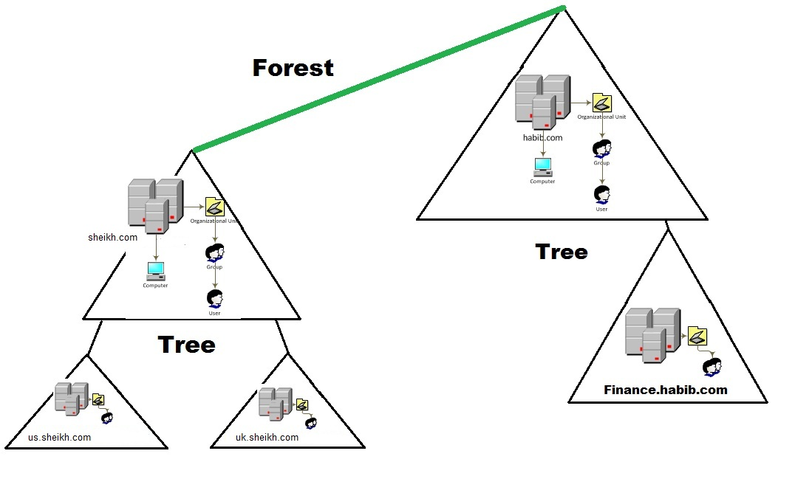

# What is Active Directory?

Active Directory (AD) is a system developed by Microsoft that helps manage users, computers, and other devices on a network. It's like a big, organized phonebook for a company's IT infrastructure, keeping track of everything and ensuring only the right people have access to the right resources.
Key Components Explained:
1. Forest:

    - Think of a forest as the entire network of your company.
    - It's the top-level container that holds everything (users, computers, and other resources).
    - It can have multiple smaller networks (trees) inside it.

2. Trees:

    - A tree is like a smaller section within the forest.
    - It consists of domains that share a common structure and are connected.
    - Multiple trees make up the forest.

3. Root:

    - The root is the first domain created in the forest.
    - It's like the starting point or the main branch from which other parts grow.
    - It often plays a central role in managing the network.

4. Domain Controller (DC):

    - A Domain Controller is a server that runs Active Directory.
    - It's like the librarian of the network, helping manage and secure the information.
    - It verifies users' identities, ensures they have the right permissions, and keeps track of everything.

5. Clients:

    - Clients are the users and devices (like your computer or phone) that connect to the network.
    - They depend on the domain controller for logging in and accessing resources.
    - Think of clients as the people using the library, needing a library card (login) to borrow books (resources)

6. OU (Organizational Unit):

	- An **Organizational Unit** is like a folder in the AD structure where you can group users, computers, and other objects.
	- It helps in organizing the network and applying policies to specific groups.

7. LDAP (Lightweight Directory Access Protocol):

	- **LDAP** is a protocol used by AD to communicate and manage the directory information.
	- It’s like the language that AD speaks to store and retrieve data

# Why DNS?
**DNS (Domain Name System)** in **Active Directory (AD)** is like the internet's phonebook for your company’s network. Here's why it's important:

- When you type a website's name into your browser, like "google.com," DNS translates that name into an IP address (like 192.168.1.1) so your computer can connect to the right server. Without DNS, you'd have to remember and type those complex numbers instead of easy names.
    
- In an Active Directory environment, DNS helps your computer find important resources like **Domain Controllers** (the servers that manage logins and permissions).
    
- When you log into your company's network or try to access shared files or printers, your computer uses DNS to quickly find and connect to these resources.
    

Without DNS, your network would struggle to connect devices and services, making it harder for users to access what they need. It’s like trying to find a friend's house without a map or address  everything would be much more complicated and slower!