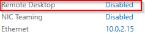

# Basic Configuration

In this guide, we will walk through the basic configuration tasks for a Windows Server. These include setting up a static IP address to ensure a consistent network connection, configuring Windows Update to keep the system up to date with the latest patches, enabling Remote Desktop Protocol (RDP) for remote access, and changing the server name to better identify your system in a networked environment. These steps are essential for optimizing server performance, ensuring security, and facilitating easier management.

# 1. Renaming the pc

To rename the system, simply click on the randomly generated username and select the "*Change*" option.

After renaming the system, you will be prompted to "**Restart**" for the changes to take effect.
# 2. Static IP

Setting a static IP for a server is an essential step in an organization's network, as it ensures the server always has the same IP address, making it easier to manage and access. Fortunately, configuring a static IP on Windows Server is a straightforward process. This ensures reliable connectivity, especially for services like file sharing, web hosting, and remote access, which rely on a consistent network address.

Click on **Server Manager** in the taskbar, then navigate to **Local Server**. Under the **Ethernet** section, you'll see the network settings, including the current IP configuration. From here, you can configure the static IP address for your server.

- Click on **Server Manager**.
- Navigate to **Local Server**.
- Under the **Ethernet** section, right-click on the network adapter.
- Select **Properties** to open the network adapter settings

In the **Properties** window, find **Internet Protocol Version 6 (TCP/IPv6)** and uncheck the box next to it. Click **OK** to apply the changes. This will disable IPv6 on your server, as it won't be used in your environment

Since we are using IPv4, select **Internet Protocol Version 4 (TCP/IPv4)** from the list and click **Properties**. This will allow you to configure the static IP settings for IPv4.

Be cautious when changing the static IP. Ensure that the IP you assign is within the range of available addresses outside of the DHCP pool to avoid conflicts. Later in the series, we'll configure the DNS server to use this server’s IP address, but for now, this configuration is perfect and will work as intended!

Click ok when everything is fine for you.

# 3. Enabling RDP Service

In the **Server Manager** console, click on the **"Disabled"** button next to **Remote Desktop** under the **Local Server** section. This will open the Remote Desktop settings, allowing you to enable it for remote access to the server

 Select the **"Allow remote connections to this computer"** option. Afterward, click **"OK"** to apply the changes and enable Remote Desktop on the server.

And that's it we have enabled RDP in this server.

# 4. System Update

It's important to always ensure that you have an up-to-date operating system running on every server. Regular updates help maintain security, improve performance, and provide new features, reducing the risk of vulnerabilities and ensuring your server operates smoothly.

These initial steps ensure that your server is ready for reliable operation and remote management.