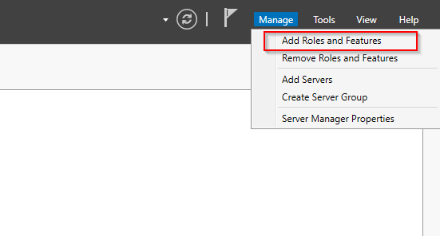
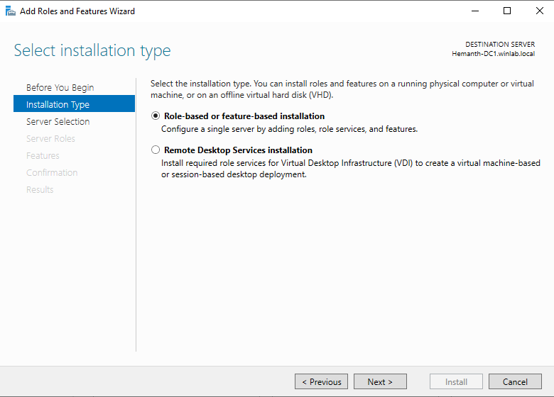

# DHCP Server using windows 2022

Before starting, ensure you have a server running Windows Server 2022 with the Domain Controller role installed, administrative privileges, a static IP address assigned to the server, and a basic understanding of networking concepts.
### Install the DHCP Server Role

1. Open **Server Manager**.
2. Click on **Manage** in the top-right corner and select **Add Roles and Features**.
3. In the **Add Roles and Features Wizard**:
    - Click **Next** on the **Before You Begin** page.
    - Choose **Role-based or feature-based installation** and click **Next**.
    - Select the local server from the server pool and click **Next**.
    - On the **Server Roles** page, check the **DHCP Server** role.
    - Click **Add Features** when prompted, then click **Next**.
    - Click **Next** on the **Features** page.
    - Review the **DHCP Server** role and click **Next**.
    - Click **Install** on the **Confirmation** page. Wait for the installation to complete.
    - Click **Close** once the installation is complete.

### Post-Installation Configuration

1. In **Server Manager**, click the **Notification Flag** in the top-right corner.
2. Click on **Complete DHCP Configuration**.
3. In the **DHCP Post-Install Configuration Wizard**:
    - Select **Use the following credentials** and ensure the **domain administrator account** is selected. Click **Next**.
    - On the **Authorize DHCP Server** page, click **Commit**.
    - Click **Close** once the configuration is complete

### Configure DHCP Scopes

1. Open **Server Manager**, and click **Tools** > **DHCP**.
2. In the DHCP console, expand your server's node in the left pane.
3. Right-click on **IPv4** and select **New Scope**.
4. Follow the **New Scope Wizard**:
    - Enter a name and description for the scope. Click **Next**.
    - Define the IP address range (start and end IP addresses) and click **Next**.
    - Set the **Subnet Mask** and click **Next**.
    - Add any exclusions and delays, if necessary, then click **Next**.
    - Set the lease duration and click **Next**.
    - Configure DHCP options such as the router (default gateway), DNS servers, and domain name. Click **Next** after each configuration.
    - Choose **Yes, I want to activate this scope now** and click **Next**.
    - Click **Finish** to complete the wizard.

You've successfully set up a DHCP server on a Windows Server 2022 Domain Controller. This setup allows your network to automatically assign IP addresses, simplifying network management.