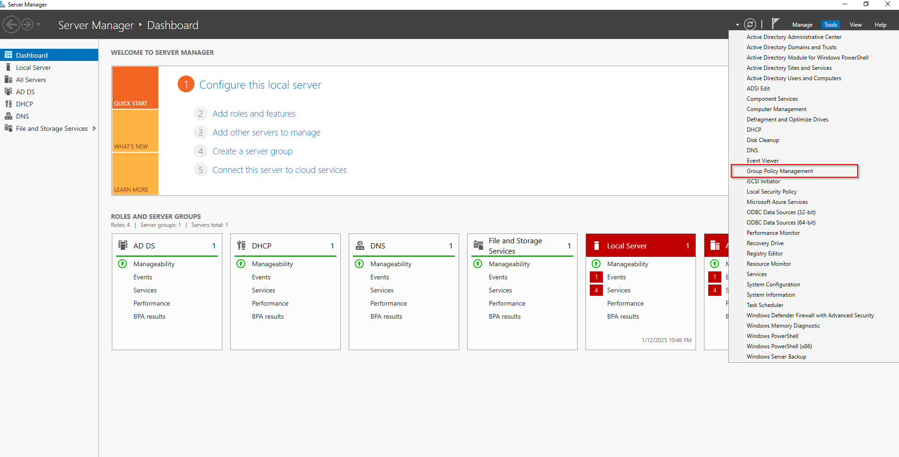
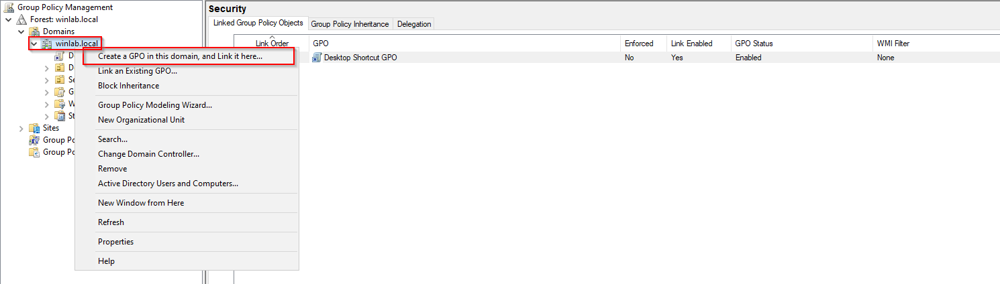
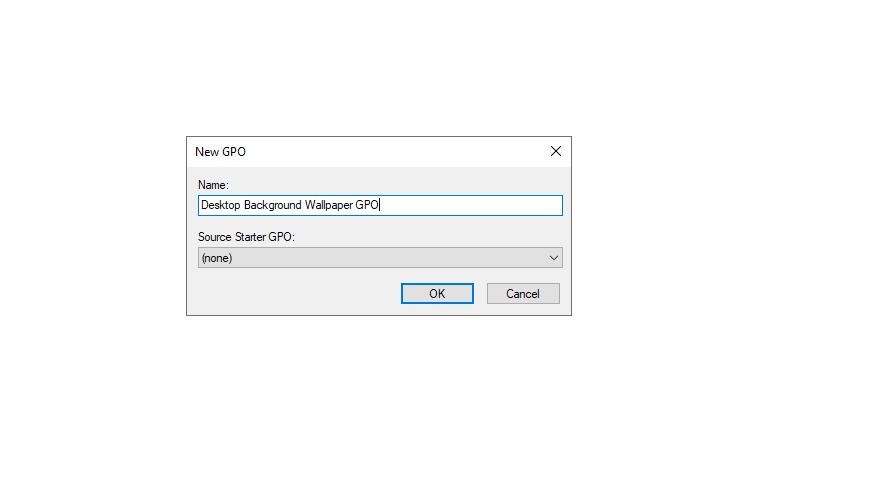
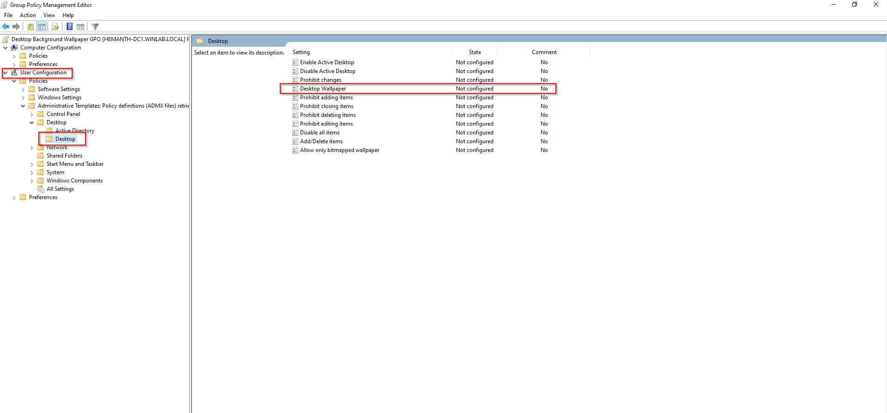
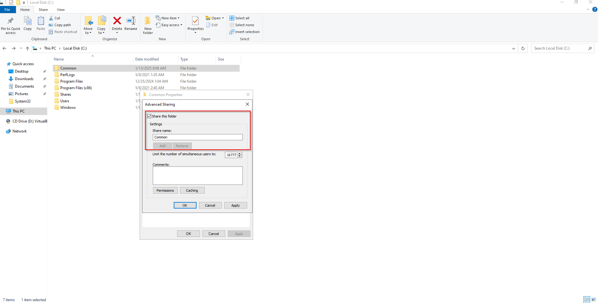
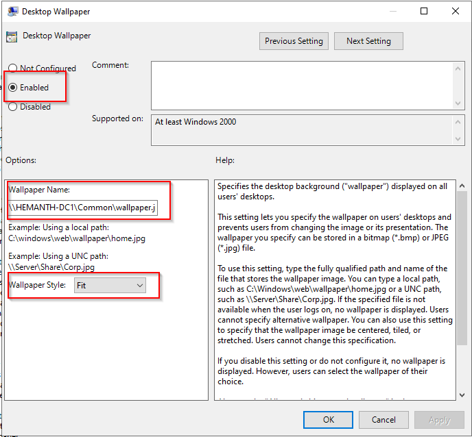
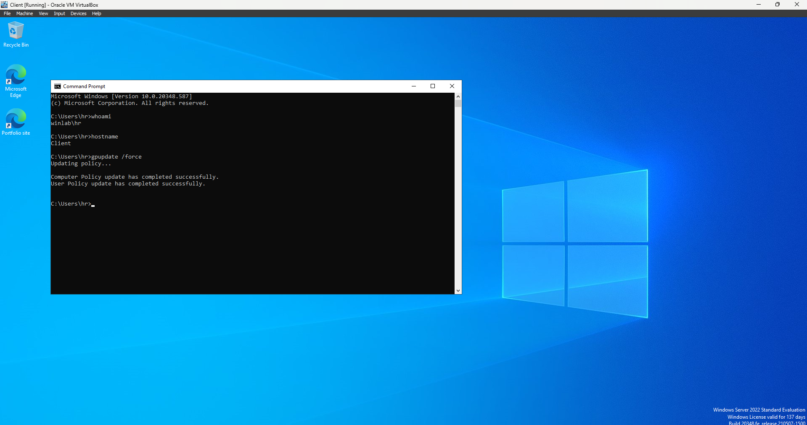
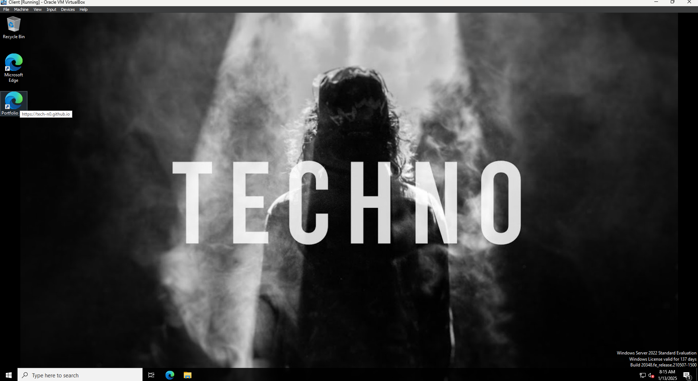
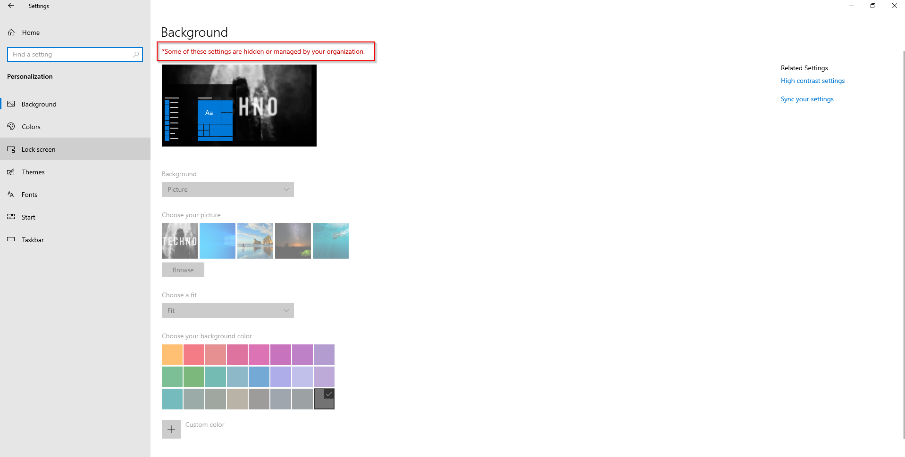

# Setting Desktop Background using GPO
### 1. Open Group Policy Management:

- On your Windows Server 2022, open **Group Policy Management**. You can do this by pressing `Win + R`, typing `gpmc.msc`, and pressing Enter.

### 2. Create or Edit a Group Policy Object (GPO):

- Navigate to the **Group Policy Objects** container in the left pane.
- Right-click it and select **Create GPO in the domain and link it here** to create a new GPO, or select an existing GPO to edit.
- Name the GPO appropriately (e.g., "Desktop Background Wallpaper GPO").




### 3. Edit the GPO:

- Right-click the newly created or selected GPO and choose **Edit**.
- In the Group Policy Management Editor, navigate to:
```
User Configuration -> Policies -Administrative Templates -> Desktop -> Desktop
```
- Find the **Desktop Wallpaper** setting.


### 4. Configure the Desktop Wallpaper Setting:

- Double-click **Desktop Wallpaper** to open its properties.
- Select **Enabled**.
- In the **Wallpaper Name** field, enter the full path to the image file you want to set as the desktop background. This can be a network path (e.g., `\\HEMANTH-DC1\Common\wallpaper.jpg`) or a local path on the user's machine.
- Choose the **Wallpaper Style** (e.g., Center, Fill, Stretch, Tile, etc.) from the drop-down menu.




### 5. Apply the GPO:

- Click **Apply**, then **OK** to save the changes.
- Close the Group Policy Management Editor.

### 6. Link the GPO to the Appropriate Organizational Unit (OU):

- In the Group Policy Management console, link the GPO to the OU containing the user accounts you want to apply this setting to.
- Right-click the desired OU, select **Link an Existing GPO**, and choose the GPO you just created or edited.

### 7. Update Group Policy on Clients:

- To apply the changes immediately, run `gpupdate /force` on the client machines.
- You can also restart the client computers, or the policy will apply during the next automatic refresh.







This process sets a uniform desktop background for users based on the GPO settings.