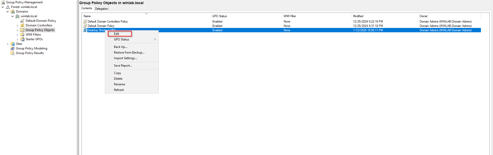
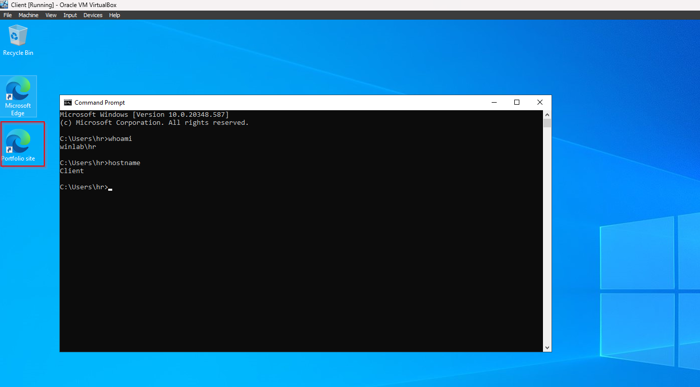

# Creating Desktop Shortcut using GPO

### 1. **Open Group Policy Management Console (GPMC):**

- Press `Win + R`, type `gpmc.msc`, and press `Enter`.
- Alternatively, go to **Start Menu** > **Administrative Tools** > **Group Policy Management**.

### 2. **Create a New GPO:**

- In the GPMC, right-click on the **Group Policy Objects** container and select **New**.
- Enter a name for the new GPO, such as "Desktop Shortcut GPO", and click **OK**.

### 3. **Edit the GPO:**

- Right-click the newly created GPO and select **Edit**.
- This opens the Group Policy Management Editor.

### 4. **Navigate to User Configuration:**

- In the Group Policy Management Editor, go to **User Configuration** > **Preferences** > **Windows Settings** > **Shortcuts**.

### 5. **Create the Shortcut:**

- Right-click on **Shortcuts** and select **New** > **Shortcut**.
- In the **New Shortcut Properties** window:
    - **Action**: Choose **Update**.
    - **Name**: Enter the name of the shortcut.
    - **Target Type**: Select the type of the target (e.g., File System Object, URL, etc.).
    - **Location**: Choose **Desktop**.
    - **Target Path**: Enter the path to the file, folder, or application the shortcut will point to.
    - Optionally, configure other settings like icon location, comment, and start in path.
- Click **OK** when done.

### 6. **Link the GPO to the Appropriate OU:**

- In the GPMC, right-click on the Organizational Unit (OU) where the GPO should apply and select **Link an Existing GPO**.
- In this example Security OU
- Select the "Desktop Shortcut GPO" GPO you created and click **OK**.

### 7. **Update Group Policy:**

- On the client machines, run `gpupdate /force` from the command prompt to apply the new GPO immediately.

### 8. **Verify the Shortcut:**

- Check the desktops of the users or computers within the OU to ensure the shortcut has been created successfully.

