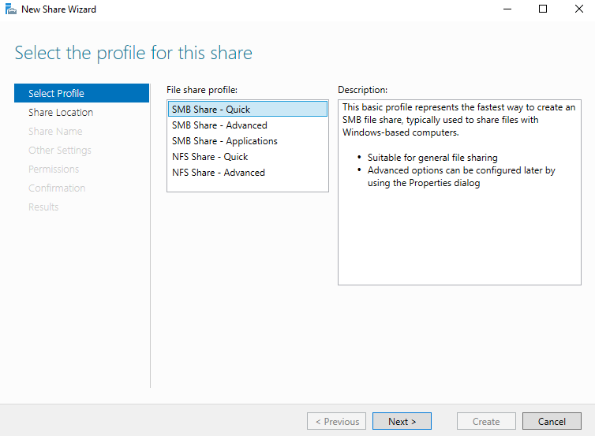
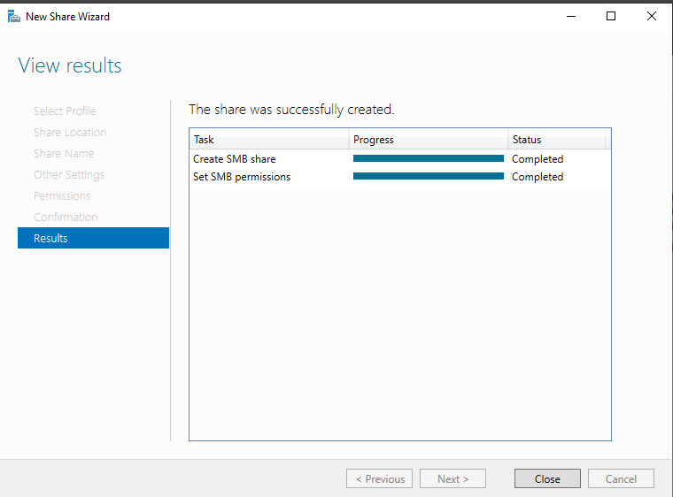

# Shared Folder - SMB

Sharing folders within a Windows environment is a common task in networks, especially in organizations. In this guide, we will walk through the steps to share a folder with file inside. Only users within a specific domain will have read and write access to this folder and file.

### Accessing File and Storage Services

Once in Server Manager, click on **File and Storage Services** from the left-hand menu

If you don't see the Shared menu in File and Storage Services, you may need to install the `File Server` feature using the "Add Roles and Features Wizard".

Now, let’s create the shared folder that will be accessible to specific domain users.
### Initiate a Shared Folder

Click on **Shares** to start the process of creating a shared folder.

### Selecting the Profile

For this demonstration, select **SMB Share - Quick** and click **Next**. This option provides a simple and fast setup for sharing folders using the SMB protocol

### Choosing the Location

You will have two options:

- Select a **Volume** to share across your network.
    
- Choose a specific **path** to share by selecting the second option.

### Providing a Share Name

Next, provide a meaningful name for your share. This name will be used by other users to access the shared folder remotely. Note down the remote path for reference.

### Configuring Additional Options

You can leave the default settings as they are or explore additional options like:

- **Access-based Enumeration**: This feature ensures that only users with the required access can see the shared folder. Others will not see it.
    
- **Encrypt Data Access**: This option encrypts the folder and its contents, providing extra security. However, it may impact network performance.

### Configuring Permissions

In the **Permissions** window:

- Remove the **Everyone** group to restrict general access.
    
- Add **BUILTIN\Users** to allow only domain users to access the folder.
    

Once done, click **OK** to apply the settings.

The shared folder creation is successfull. Now lets create some file and content.
#### **Creating the Folder and File**

**Open the Folder**
    
- Right-click on your share and click open share.
        

**Create the File**
    
- Double-click the `Secret` folder to open it.
        
- Right-click inside the folder and select `New` > `Text Document`.
        
 - Name the file `secret.txt`.

#### **Kali machine**

On our Kali machine, let's attempt to list the shared folder and its contents. Using tools like `smbmap`, you can list the shared folders. Due to the ACL setup, you will need to provide domain user credentials to access the shares.

We are able to see the "secret.txt" file listed using smbmap.

For fun, let's download the file on the Kali machine and read its content. With this, we've successfully shared a file in Windows across systems connected through the same network.

